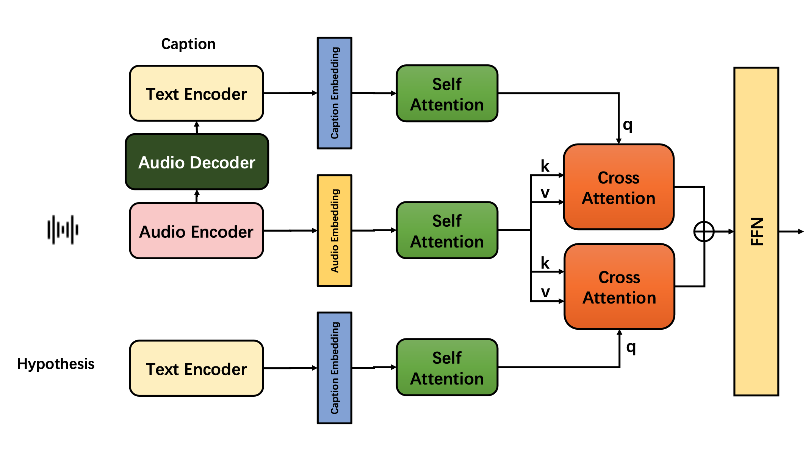

# Attention Based Audio Entailment
<div align=center>

</div>

## How to run the code
```
python main.py -m train -c config.yaml -md attention 
```
```
python main.py -m test -c config.yaml -md attention 
```


•	-m: Selects the mode to run (train or test).  
•	-c: Specifies the path to the configuration file (config.yaml by default).  
•	-md: Chooses the model to use (mlp or attention).  

## Results

| Model | Accuracy | F1 Score | Precision | Recall |
| --- | --- | --- | --- | --- |
| MLP | 90.93% | 0.9087 | \ | \ |
| Attention | 91.2% | 0.913 | \ | \ |
