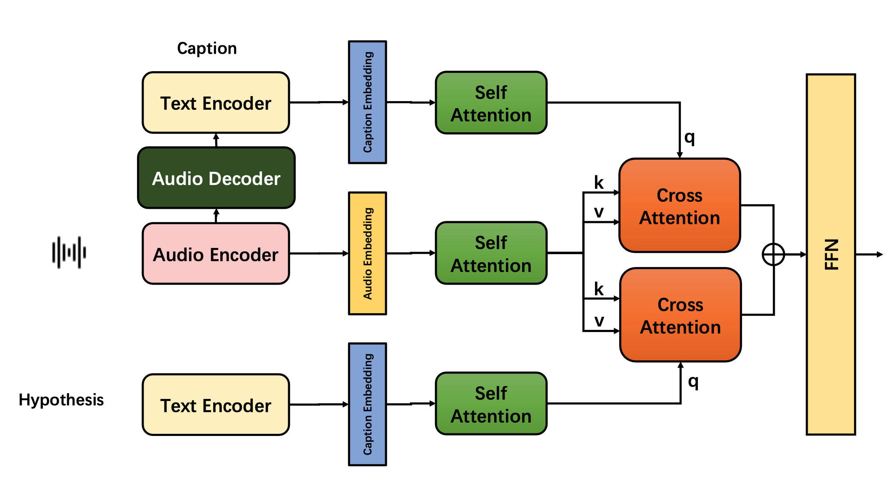

# Attention Based Audio Entailment
<div align=center>

</div>

## How to run the code
```
python main.py -m train -c config.yaml -md attention 
```
```
python main.py -m test -c config.yaml -md attention 
```


•	-m: Selects the mode to run (train or test).  
•	-c: Specifies the path to the configuration file (config.yaml by default).  
•	-md: Chooses the model to use (mlp or attention).  

## Results
| Model | Accuracy | Precision | Recall | F1 Score |
| --- | --- | --- | --- | --- |
| Baseline | 0.8640 | 0.8671 | 0.8640 | 0.8647 |
| MLP | 0.8737 | 0.8760 | 0.8737 | 0.8742 |
| **Attention** | **0.8927** | **0.8921** | **0.8923** | **0.8921** |
